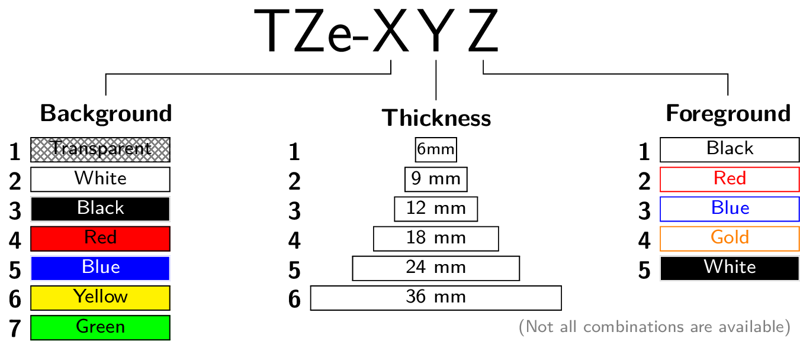

# Brother TZe Naming convention diagram

This reposistory uses tikz to make the TZe naming convention for Brother Labeling machines more understandable. The information is extracted from the [german version of the technical datasheet for TZe Writing Tapes](https://www.brother.de/-/media/pdf/de/technische-daten-tze-hge-schriftbaender.pdf)

